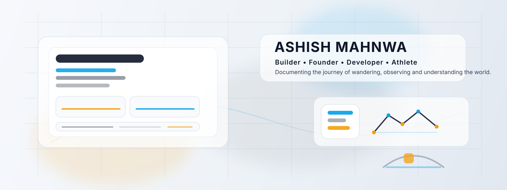
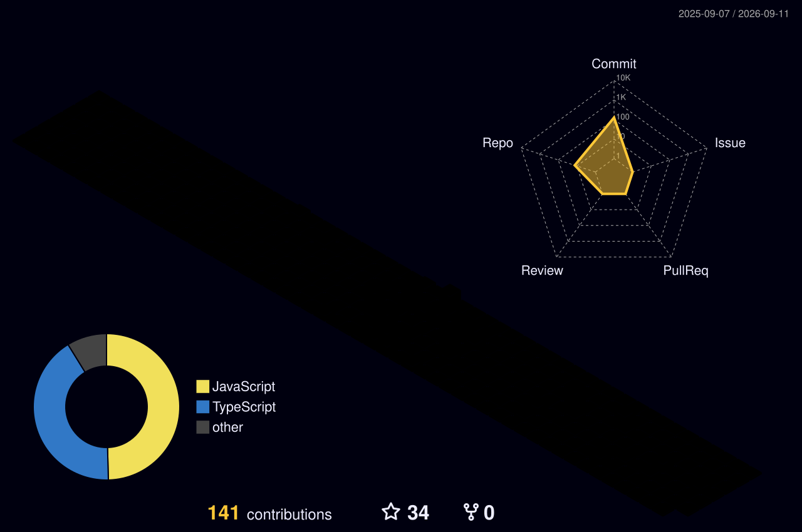

  <a href="https://atomashoff.netlify.app/" target="_blank">
    <picture>
      <source media="(prefers-color-scheme: dark)" srcset="assets/header-dark.svg">
      
    </picture>
  </a>

   

  

   

  &nbsp;
  &nbsp;
  &nbsp;
  &nbsp;
 

 

  

 

  

  

 

<table align="center" border="0" cellpadding="0" cellspacing="0" width="100%">
  <tr>
    <td width="50%" align="center">
      
    </td>
    <td width="50%" align="center">
      
    </td>
  </tr>
  <tr>
    <td width="50%" align="center">
      
    </td>
    <td width="50%" align="center">
      
    </td>
  </tr>
</table>

 

  

 

## 
🧑‍💻 Tech Stack

 

<table align="center">
  <tr>
    <td align="center" width="110" height="90">
      
       <b>React</b>
    </td>
    <td align="center" width="110" height="90">
      
       <b>Next.js</b>
    </td>
    <td align="center" width="110" height="90">
      
       <b>Node.js</b>
    </td>
    <td align="center" width="110" height="90">
      
       <b>Express</b>
    </td>
    <td align="center" width="110" height="90">
      
       <b>PostgreSQL</b>
    </td>
    <td align="center" width="110" height="90">
      
       <b>MongoDB</b>
    </td>
    <td align="center" width="110" height="90">
      
       <b>Python</b>
    </td>
  </tr>
  <tr>
    <td align="center" width="110" height="90">
      
       <b>HTML</b>
    </td>
    <td align="center" width="110" height="90">
      
       <b>CSS</b>
    </td>
    <td align="center" width="110" height="90">
      
       <b>JavaScript</b>
    </td>
    <td align="center" width="110" height="90">
      
       <b>SQL</b>
    </td>
    <td align="center" width="110" height="90">
      
       <b>Git</b>
    </td>
    <td align="center" width="110" height="90">
      
       <b>Vercel</b>
    </td>
    <td align="center" width="110" height="90">
      
       <b>Railway</b>
    </td>
  </tr>
</table>

 

  

 

## 
⚡ Featured Project — Atom OS

 

  &nbsp;
  &nbsp;
  

    

  

   

  &nbsp;
  &nbsp;
  &nbsp;
  &nbsp;
  &nbsp;
  

 

  

 

## 
🏆 Achievements

 

<table align="center" border="0" cellspacing="0" cellpadding="8">
  <tr>
    <td align="center" width="140">
       
      <b>National Yoga</b> 
      Gold Medalist
    </td>
    <td align="center" width="140">
       
      <b>Guard of Honour</b> 
      National War Memorial
    </td>
    <td align="center" width="140">
       
      <b>Smart India</b> 
      Hackathon
    </td>
    <td align="center" width="140">
       
      <b>Fitness</b> 
      Certified Trainer
    </td>
    <td align="center" width="140">
       
      <b>Nutrition</b> 
      Certified Nutritionist
    </td>
  </tr>
  <tr>
    <td align="center" width="140">
       
      <b>Vice Captain</b> 
      School Leader
    </td>
    <td align="center" width="140">
       
      <b>NCC</b> 
      Leading Cadet
    </td>
    <td align="center" width="140">
       
      <b>Football</b> 
      Athlete
    </td>
    <td align="center" width="140">
       
      <b>Zespo</b> 
      Product Designer
    </td>
    <td align="center" width="140">
       
      <b>Bond Bazar</b> 
      Internship
    </td>
  </tr>
</table>

 

  

 

## 
📊 GitHub Analytics

 

  <table>
    <tr>
      <td align="center" width="50%">
        
      </td>
      <td align="center" width="50%">
        
      </td>
    </tr>
  </table>

 

  

 

  

 

  

 

  

 

## 
🤝 Connect

 

  &nbsp;
  &nbsp;
  &nbsp;
  &nbsp;
  

 

  

